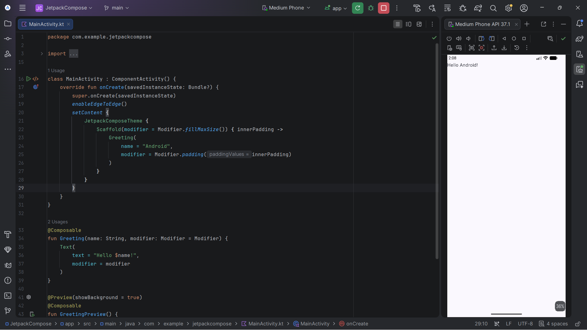

# 📱 Tugas 1 - Hello Android!

[](https://developer.android.com/)
[](https://kotlinlang.org/)
[](https://developer.android.com/jetpack/compose)

---

## 👤 Informasi Mahasiswa

| Data | Keterangan |
| :--- | :--- |
| **Nama** | Muhammad Nafis Al Khalifi |
| **NIM** | 5053251019 |
| **Kelas** | M |
| **Mata Kuliah** | Pemrograman Perangkat Bergerak / Mobile Programming |

---

## 📝 Deskripsi Proyek

Proyek ini merupakan implementasi tugas pertemuan 2 pemrograman perangkat bergerak. Aplikasi ini berfokus pada pembuatan antarmuka pengguna sederhana menggunakan toolkit modern **Jetpack Compose** dengan menampilkan teks ucapan **"Hello Android!"**.

---

## 📸 Hasil Tampilan (Preview / Output)

Berikut adalah tampilan antarmuka aplikasi saat dibuka di Android Studio menggunakan mode **Split (Code + Preview)**:

<p align="center">
  
</p>

---

## 💻 Penjelasan Kode Sumber (`MainActivity.kt`)

Kode utama aplikasi terletak pada berkas [`MainActivity.kt`](app/src/main/java/com/example/jetpackcompose/MainActivity.kt):

```kotlin
package com.example.jetpackcompose

import android.os.Bundle
import androidx.activity.ComponentActivity
import androidx.activity.compose.setContent
import androidx.activity.enableEdgeToEdge
import androidx.compose.foundation.layout.fillMaxSize
import androidx.compose.foundation.layout.padding
import androidx.compose.material3.Scaffold
import androidx.compose.material3.Text
import androidx.compose.runtime.Composable
import androidx.compose.ui.Modifier
import androidx.compose.ui.tooling.preview.Preview
import com.example.jetpackcompose.ui.theme.JetpackComposeTheme

class MainActivity : ComponentActivity() {
    override fun onCreate(savedInstanceState: Bundle?) {
        super.onCreate(savedInstanceState)
        enableEdgeToEdge()
        setContent {
            JetpackComposeTheme {
                Scaffold(modifier = Modifier.fillMaxSize()) { innerPadding ->
                    Greeting(
                        name = "Android",
                        modifier = Modifier.padding(innerPadding)
                    )
                }
            }
        }
    }
}

@Composable
fun Greeting(name: String, modifier: Modifier = Modifier) {
    Text(
        text = "Hello $name!",
        modifier = modifier
    )
}

@Preview(showBackground = true)
@Composable
fun GreetingPreview() {
    JetpackComposeTheme {
        Greeting("Android")
    }
}
```

### 🔍 Bedah Komponen Kode:

1. **`MainActivity : ComponentActivity()`**  
   Titik masuk utama (*entry point*) aktivitas aplikasi Android berbasis Compose.

2. **`enableEdgeToEdge()`**  
   Mengaktifkan tata letak layar penuh (*edge-to-edge*) sehingga konten dapat ditampilkan hingga di bawah status bar dan navigation bar.

3. **`setContent { ... }`**  
   Fungsi untuk mendefinisikan layout UI menggunakan Composable functions menggantikan metode lama `setContentView(R.layout...)`.

4. **`JetpackComposeTheme` & `Scaffold`**  
   - `JetpackComposeTheme`: Menerapkan tema warna, tipografi, dan bentuk berbasis Material Design 3.
   - `Scaffold`: Struktur tata letak dasar Material Design yang menyediakan slot penataan komponen serta penanganan otomatis `innerPadding`.

5. **`@Composable fun Greeting(name: String, modifier: Modifier = Modifier)`**  
   Fungsi modular yang dapat digunakan kembali (*reusable UI component*) untuk merender teks `"Hello Android!"` menggunakan komponen bawaan `Text()`.

6. **`@Preview(showBackground = true)`**  
   Anotasi khusus Android Studio yang memungkinkan visualisasi Composable secara *real-time* di panel Design/Split tanpa perlu menjalankan aplikasi di emulator atau perangkat fisik.

---

## 🛠️ Spesifikasi & Teknologi

- **Bahasa Pemrograman**: Kotlin
- **UI Framework**: Jetpack Compose (Material 3)
- **Minimum SDK**: API 24 (Android 7.0 Nougat)
- **Target SDK**: API 37
- **Java Version**: Java 11
- **IDE**: Android Studio (Ladybug / Iguana / Koala atau versi terbaru)

---

## 🚀 Cara Menjalankan Proyek

1. **Clone repositori ini:**
   ```bash
   git clone https://github.com/[username-anda]/[nama-repo].git
   ```
2. **Buka di Android Studio:**
   - Pilih **File** > **Open...**
   - Navigasikan ke direktori hasil clone proyek ini.
3. **Sinkronisasi Gradle:**
   - Tunggu hingga Android Studio selesai mengunduh dependencies dan menyinkronkan Gradle project.
4. **Melihat Hasil Preview:**
   - Buka file `app/src/main/java/com/example/jetpackcompose/MainActivity.kt`.
   - Di pojok kanan atas editor, klik tombol **Split** atau **Design**.
   - Tunggu beberapa detik hingga panel **GreetingPreview** selesai me-render tampilan teks `"Hello Android!"`.
5. **Menjalankan di Emulator / HP:**
   - Hubungkan HP Android dengan mode *USB Debugging* aktif atau jalankan Android Virtual Device (AVD).
   - Klik tombol **Run 'app'** (`Shift + F10` atau ikon segitiga hijau) di toolbar atas.
